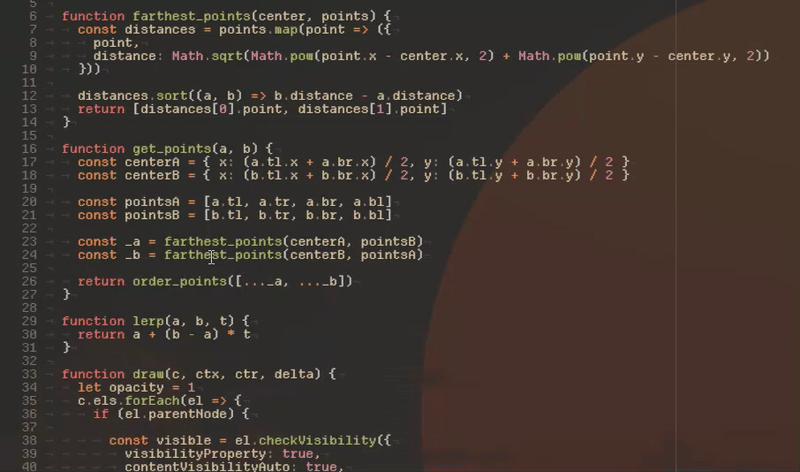

## Requirements

This extensions makes use of [CustomCssJS](https://marketplace.visualstudio.com/items?itemName=be5invis.vscode-custom-css).  
Make sure its installed.

## Extension Settings

This extension contributes the following commands:

* `smearcursor.enable`: Enable the cursor effect.
* `smearcursor.disable`: Disable the cursor effect.

This extension contributes the following settings:

* `smearcursor.animation_time`: Animation Time
* `smearcursor.max_length`: Max trail length
* `smearcursor.tip_shrink`: How much the cursor shrinks when moving
* `smearcursor.tail_shrink`: How much the cursor shrinks when moving

## Known Issues

--

## Release Notes

Users appreciate release notes as you update your extension.

### 0.0.1
Initial release of SmearCursor

### 1.0.0
Added Logo and License

### 1.0.1
Fixed readme link...

### 1.0.2
Fixed image...
